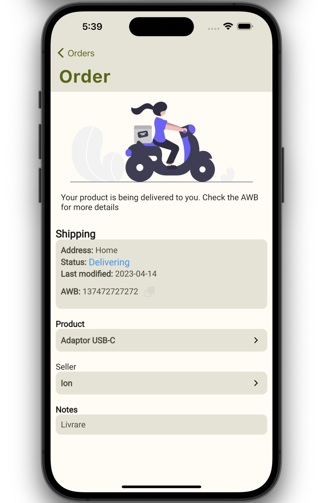
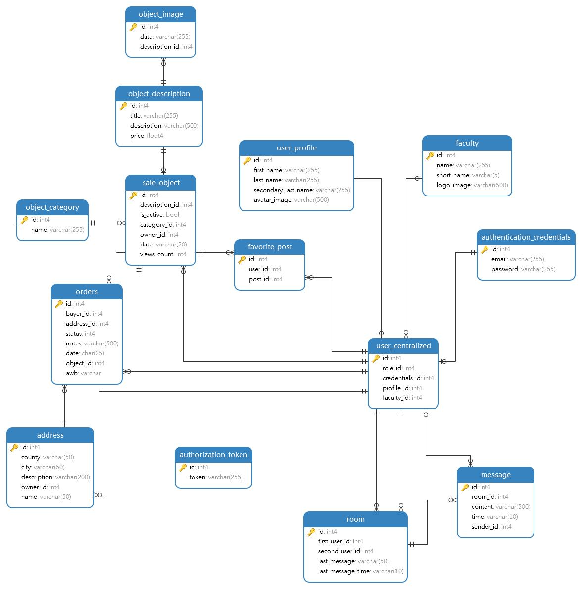
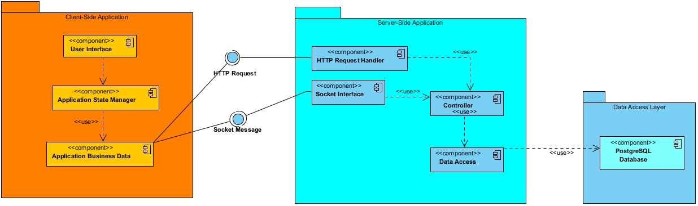
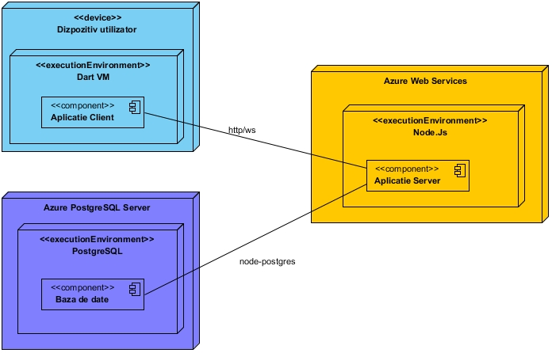
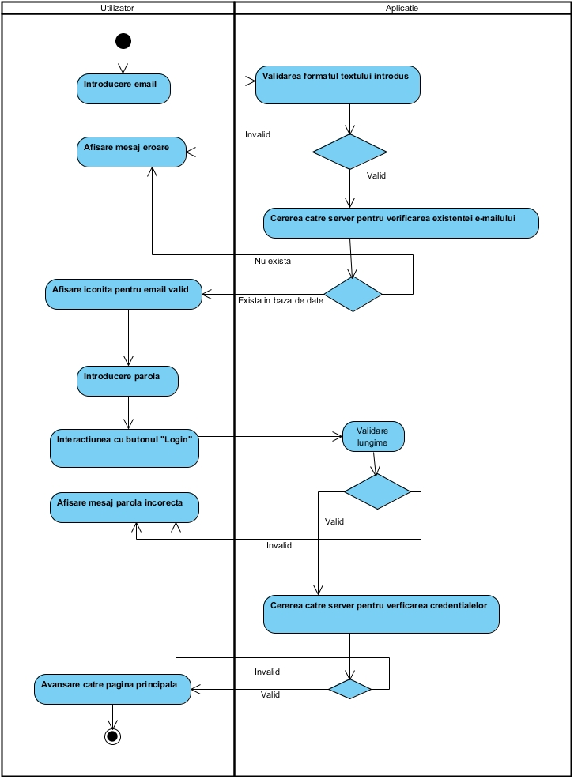
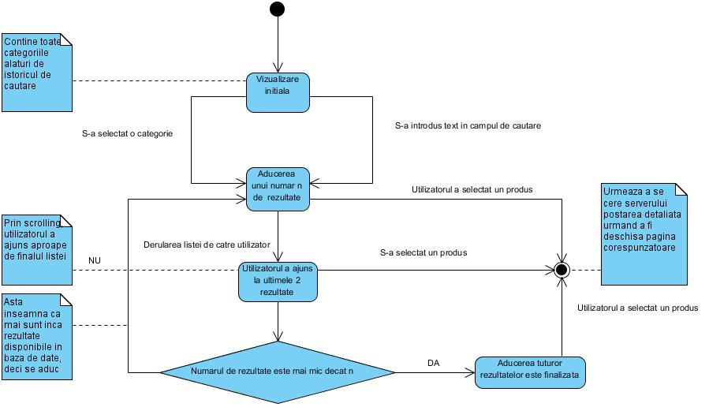
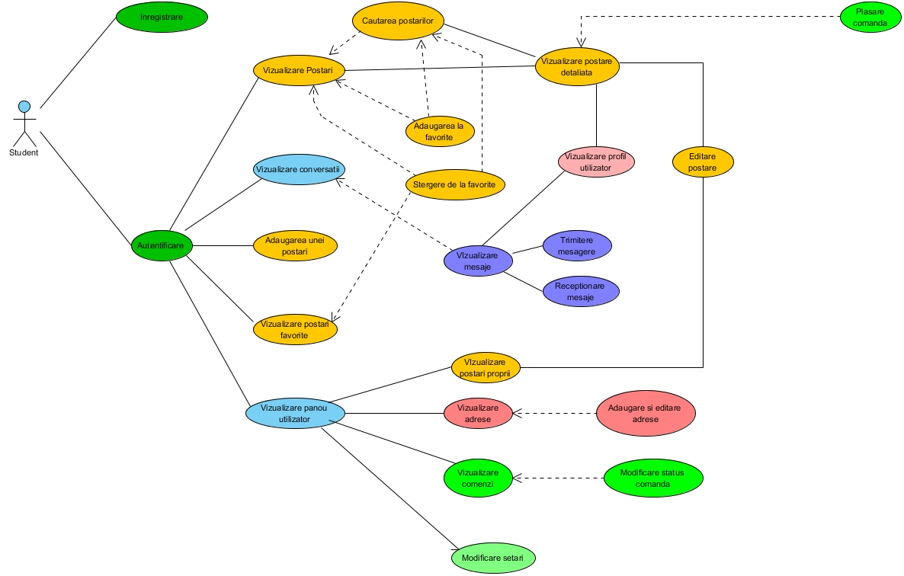
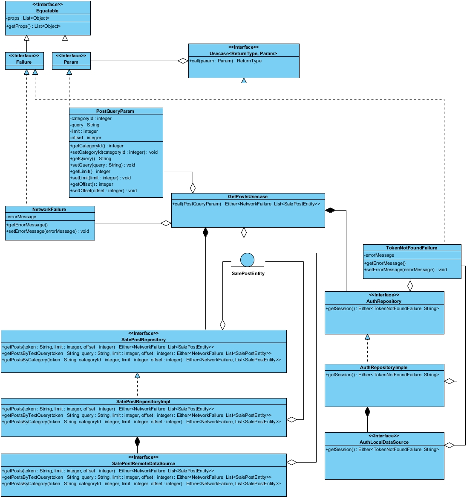

# 🎓 Student Marketplace

[](https://flutter.dev)
[](https://pub.dev/packages/flutter_bloc)
[](https://nodejs.org)
[](https://www.postgresql.org)

A high-performance, cross-platform marketplace ecosystem designed for students. This project enables users to list items for sale and facilitates a complete buying experience with address management and order tracking.

---

## 📱 Screenshots

<p align="center">
  
  
  
  
  
</p>

---

## 🏗️ Architecture Overview

This project follows **Clean Architecture** principles, ensuring that the business logic is entirely decoupled from the UI and the data sources.

### 🔍 Technical Deep Dive & UML Gallery
The following diagrams represent the complete architectural and behavioral modeling of the Student Marketplace. **Click on any image to view the full-size version.**

#### **1. Structural & Infrastructure Modeling**
These diagrams define the static skeleton of the application, ensuring data consistency and clear component boundaries.

<p align="center">
  <a href="assets/diagrams/DatabaseDiagram.jpg"></a>
  <a href="assets/diagrams/ComponentDiagram.jpeg"></a>
  <a href="assets/diagrams/DeploymentDiagram.jpg"></a>
</p>

* **Database Schema:** A relational PostgreSQL model designed to handle complex relationships between Students, Sale Posts, and Orders. It utilizes foreign key constraints to ensure ACID compliance and data integrity. 
* **Component Diagram:** Illustrates the modular organization of the system. It highlights how the `business_logic` package remains a "Pure Dart" entity, independent of the Flutter framework.
* **Deployment Diagram:** Maps the physical execution environment, detailing the communication protocols between the Flutter mobile client, the Node.js API runtime, and the PostgreSQL data store.

#### **2. Behavioral & Workflow Modeling**
These models capture how the system responds to user events and how data transitions through various marketplace states.

<p align="center">
  <a href="assets/diagrams/ActivityDiagram.jpg"></a>
  <a href="assets/diagrams/StateDiagram.jpg"></a>
  <a href="assets/diagrams/SearchStateDiagram.jpg"></a>
</p>

* **Activity Diagram:** Captures the dynamic flow of the "Buy Item" use case, modeling the decision logic from item selection to address validation and final transaction confirmation. 
* **State Diagrams:** Defines the finite states of the system entities. The **Search State Diagram** specifically manages the complex transitions between idle, loading, filtered, and error states within the UI to ensure a seamless user experience.

#### **3. Functional & Domain Modeling**
Focuses on actor interactions and the internal class hierarchies that drive the Clean Architecture layers.

<p align="center">
  <a href="assets/diagrams/StudentUsecaseDiagram.jpg"></a>
  <a href="assets/diagrams/BusinessDataClassDiagram.jpg"></a>
  <a href="assets/diagrams/PresentationClassDiagram.jpg"></a>
</p>

* **Usecase Diagrams:** Explicitly defines the boundaries of the system by identifying primary actors (Students, Faculty) and their allowed interactions, such as listing items or initiating real-time chats.
* **Class Diagrams:** Detailed blueprints for the **Domain** and **Presentation** layers. These highlight the implementation of the **Repository Pattern** and the mapping between BLoC states and UI components.

---

### 1. 🧠 Business Logic Layer (`student_marketplace_business_logic`)
A standalone, pure Dart package that acts as the "Engine" of the app.
* **Domain Layer:** Contains **Entities** and **Usecases** (the core business rules).
* **Data Layer:** Contains **Repositories** and **Models** (mapping JSON to Entities).
* **Key Modules:** Logic for `authentication`, `orders`, `sale_posts`, and `messaging`.

### 2. 📱 Presentation Layer (`student_marketplace_presentation`)
The Flutter application that interacts with the user.
* **BLoC Pattern:** Each feature is controlled by a dedicated Business Logic Component.
* **Feature-Driven UI:** Modular design where each folder (e.g., `create_order`, `detailed_post`) contains its own logic, widgets, and state management.
* **Multi-Platform:** Support for Android, iOS, macOS, Windows, and Web.

### 3. 🌐 Backend Layer (`student_marketplace_backend`)
A Node.js REST API serving as the central data hub.
* **Database:** **PostgreSQL** handles relational data for users, products, and transactions.
* **Storage:** Local filesystem handling for `uploads/avatars` and `uploads/sale_posts`.
* **Structure:** Organized by `controllers`, `routes`, and `db` for easy maintenance.

---

## 📁 Project Structure

```text
.
├── assets/                         # Visual assets and screenshots
│   └── diagrams/                   # UML and System Diagrams
├── student-marketplace-backend/    # Node.js + Express API
│   ├── src/
│   │   ├── controllers/            # Request logic
│   │   ├── db/                     # Postgres config & models
│   │   └── routes/                 # API Endpoints
│   └── uploads/                    # Product & Profile images
└── student-marketplace-frontend/
    ├── business_logic/             # Pure Dart Logic (Domain/Data layers)
    │   └── lib/domain/usecases/    # Business rules (orders, auth, etc.)
    └── presentation/               # Flutter App (UI/BLoC)
        └── lib/features/           # Individual UI modules
